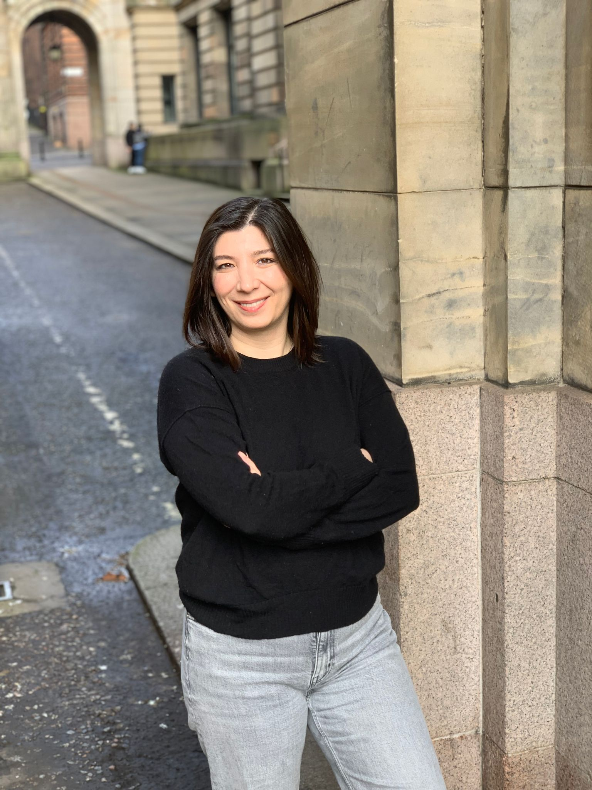

<!-- PROFILE SECTION -->

  

    
  

  

    
 Welcome! I am a visiting fellow at the University of Glasgow and an Assistant Professor of Political Science and International Relations at Çukurova University. 
My research mainly focuses on authoritarian politics, political behavior and attitudes of minorities, and Turkish politics. I conduct experiments and observational analysis.  My work has been published in Conflict Management and Peace Science, and Southeast European and Black Sea Studies. 
I received my PhD in Political Science from Rutgers University. I also hold an M.A. in Political Science from Rutgers University and in International Relations from the Turkish War Academia, as well as a B.A. in International Relations from Ege University. 
  

  

## Menu

- [Research](research.md)
- [Teaching](teaching.md)
- [CV](cv.md)
- [Contact](contact.md)
